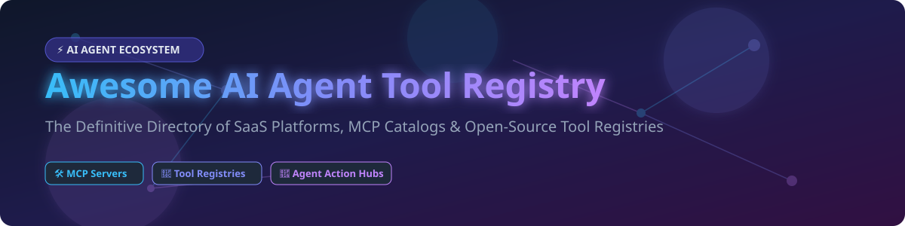

# 🤖 Awesome AI Agent Tool Registry

  
  
  
  

## 📌 Top AI Agent Tool Registry & MCP Catalog Ecosystem

**A Curated List of SaaS Products & Open-Source GitHub Projects**  
*Focused on Tool Registries for AI Agents, Model Context Protocol (MCP) Server Catalogs, API Integration Hubs, Composable Agent Actions & Discoverable Tooling.*

**Last updated: September 2026** 📅

---

### 💡 Overview & Market Insights

This repository tracks notable **SaaS platforms** and **open-source repositories** for **AI Agent Tool Registries**. These infrastructure components catalog, host, authenticate, and expose tools, APIs, and [Model Context Protocol (MCP)](https://modelcontextprotocol.io/) servers so AI agents can dynamically discover and invoke external capabilities (CRMs, databases, code repositories, browsers, communication channels) in a standardized, secure manner.

> 📈 **Market Size & Industry Structure:**  
> The **AI Agent Integration & Tool Infrastructure Market** is estimated at **$1.8B - $2.5B in 2026** and is projected to expand rapidly beyond **$12B by 2030** (CAGR ~45%). The sector is currently **highly fragmented**, characterized by rapid open-source innovation around the MCP standard alongside venture-backed SaaS startups and enterprise integration giants competing to establish dominant ecosystem hubs.

---

## 📑 Table of Contents

- [☁️ SaaS / Hosted Platforms](#-saas--hosted-platforms)
- [🔓 Open-Source GitHub Projects](#-open-source-github-projects)
- [🤝 How to Contribute](#-how-to-contribute)
- [🔒 Security & Disclaimer](#-security--disclaimer)

---

## ☁️ SaaS / Hosted Platforms

Below is a detailed comparison of commercial SaaS tool registries and integration hubs for AI agents. The table is sorted by company size (valuation / funding) in descending order.

| Platform | Enterprise Scale (Valuation / Funding) 📊 | Starting Tier Price 💰 | Free Tier / Free Trial Limits 🎁 | Key Features & Capabilities 🛠️ |
| :--- | :--- | :--- | :--- | :--- |
| **[Zapier](https://zapier.com/)** | **$5.0B Valuation** (~$2.68M raised) | **$19.99/mo** (Starter plan billed annually) | **100 tasks/month free forever**, 2-step single-trigger Zaps | Industry-standard automation engine with Zapier MCP integration for 6,000+ app connectors. |
| **[LangChain Hub](https://smith.langchain.com/)** | **$1.25B Valuation** (~$150M+ raised) | **$20.00/user/mo** (LangSmith Developer plan) | **5,000 trace units/month free**, free access to public prompt & tool hub | Prompts, tools, and chain registry embedded inside the LangSmith observability platform. |
| **[Pipedream](https://pipedream.com/)** | **Acquired by Workday** (~$22.4M raised) | **$19.00/mo** (Basic plan) | **100 credits/month free forever** (~100 workflow invocations) | Developer-centric workflow integration engine offering composable action tools & MCP endpoints. |
| **[Composio](https://composio.dev/)** | **~$29.0M Total Funding** ($25M Series A) | **$29.00/mo** (Developer tier) | **20,000 free tool calls/month** forever | Production-ready managed auth (OAuth, API keys) for 250+ SaaS tools & native framework integration. |
| **[Trigger.dev](https://trigger.dev/)** | **~$19.0M Total Funding** ($16M Series A) | **$25.00/mo** (Hobby plan baseline) | **$5.00/month free usage credits** (~10,000 run seconds & 10 concurrent runs) | Open-source background job framework with hosted cloud service for durable agent workflows. |
| **[Apideck](https://apideck.com/)** | **~$13.0M Valuation** (~$7.5M raised) | **$249.00/mo** (Growth plan) | **30-day full feature free trial** (No permanent free plan) | Real-time Unified APIs with managed sandbox testing and enterprise governance tooling. |
| **[Superface](https://superface.ai/)** | **~€3.8M Total Funding** | **€49.00/mo** (Starter plan) | **1,000 free API runs/month** forever | Autonomous API integration layer translating OpenAPI schemas into zero-code agent tools. |
| **[Smithery](https://smithery.ai/)** | **~$400K Seed Funding** | **$15.00/mo** (Pro Server Hosting) | **Unlimited public MCP discovery** & community hub CLI search | Dedicated MCP server hosting platform, registry index, and client configuration builder. |
| **[Toolhouse](https://www.toolhouse.ai/)** | **Pre-Seed / Seed Stage** | **$49.00/mo** (Starter tier) | **500 free tool executions/month** forever | Turnkey agent tool infrastructure providing managed authentication and cloud code sandboxes. |

---

## 🔓 Open-Source GitHub Projects

Below are top open-source registries, MCP server indexes, and agent tool frameworks. The list is sorted by **GitHub Star Count (descending)**, with each star badge linking directly to the repository's stargazers page.

| Open-Source Project 🐙 | Star Count & Stargazers ⭐️ | Description & Registry Role 🎯 |
| :--- | :--- | :--- |
| **[langchain-ai/langchain](https://github.com/langchain-ai/langchain)** |  | Standard framework for building LLM applications; includes comprehensive tool & integration ecosystem. |
| **[modelcontextprotocol/servers](https://github.com/modelcontextprotocol/servers)** |  | Official reference implementation repository of Model Context Protocol (MCP) servers maintained by Anthropic & community. |
| **[crewAIInc/crewAI](https://github.com/crewAIInc/crewAI)** |  | Leading multi-agent framework featuring CrewAI Tooling registry for role-based tool delegation. |
| **[run-llama/llama_index](https://github.com/run-llama/llama_index)** |  | Data framework for LLM applications with LlamaHub—a community registry for data loaders and agent tools. |
| **[glama-ai/mcp-servers](https://github.com/glama-ai/mcp-servers)** |  | Open community directory indexing tens of thousands of MCP servers with automated health checks. |
| **[agentregistry-dev/agentregistry](https://github.com/agentregistry-dev/agentregistry)** |  | Open-source centralized registry for MCP servers, agent skills, prompts, and server deployment governance. |
| **[michielhdoteth/awesome-ai-agent-tools](https://github.com/michielhdoteth/awesome-ai-agent-tools)** |  | Curated catalog of agent components, MCP tools, skills, subagents, and automated installation scripts. |
| **[mcpfinder/mcpfinder](https://github.com/mcpfinder/mcpfinder)** |  | Discovery & installation layer aggregating multiple MCP registries with client config generation. |
| **[opentool-dev/opentool](https://github.com/opentool-dev/opentool)** |  | Unified open-source MCP server aggregating multi-provider authenticated access (GitHub, Notion, Slack). |

---

### 🔑 Key Takeaways & Architecture Recommendations

- **MCP-Native Standardization:** Anthropic's Model Context Protocol (MCP) has emerged as the universal standard for agent tool discovery and execution.
- **Hybrid Enterprise Stacks:** Leading organizations leverage open-source MCP servers for custom internal tools while adopting commercial platforms (Composio, Zapier, Pipedream) for managed OAuth and enterprise SaaS integrations.
- **Security & Data Governance:** Exposing external tool capabilities to autonomous LLM agents introduces prompt injection and unauthorized execution risks. Always enforce zero-trust credentials and private registries in production environments.

---

## 🤝 How to Contribute

We welcome community contributions! Follow these steps to submit additions or updates:

1. 🍴 **Fork** this repository.
2. 📝 **Add/edit** entries in `README.md` maintaining the existing Markdown table format.
3. ℹ️ **Provide exact details:** Name, official link, starting tier pricing, free tier/trial limits, valuation/funding data, or GitHub repo URL.
4. 🚀 **Submit a Pull Request (PR)** with a clear summary of your changes.

---

## 🔒 Security & Disclaimer

- **Community Curated:** This list is maintained for educational and informational purposes. Inclusion does not imply official endorsement.
- **Tool Privilege Risk:** Granting AI agents read/write capabilities to third-party tools creates data exfiltration and integrity risks. Implement fine-grained permission controls, scope limits, and human-in-the-loop validation for destructive actions.

---

  <b>Built with ❤️ for AI Engineers, Agent Developers, and Platform Teams.</b> 
  <i>Star ⭐️ this repository to stay updated on the evolving AI Agent Tool Registry ecosystem!</i>

